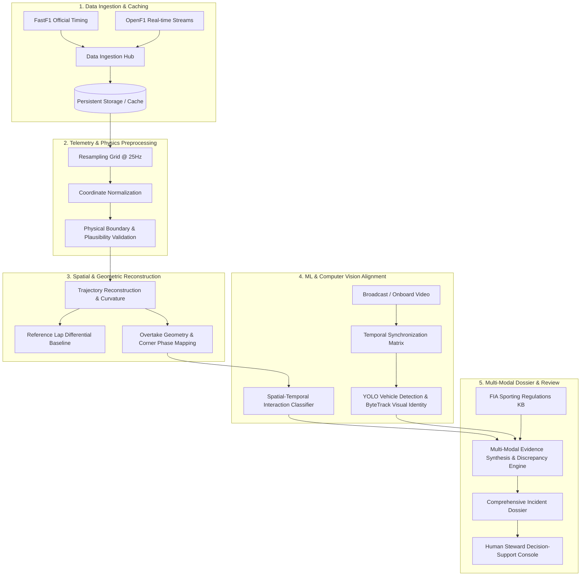

# Motorsport Incident Intelligence (MII)

[](https://python.org)
[](https://fastapi.tiangolo.com)
[](https://react.dev)
[](https://www.typescriptlang.org)
[](https://www.postgresql.org)
[](https://www.docker.com)
[](backend/app/tests)

**Motorsport Incident Intelligence (MII)** is an evidence-synthesis and decision-support platform engineered for professional motorsport race stewards and officiating bodies. By fusing high-frequency telemetry, spatial trajectory reconstruction, multi-modal reference baselines, computer vision tracking, and FIA regulatory frameworks, MII accelerates post-incident review cycles while upholding strict epistemic integrity.

---

## Non-Adjudicative Philosophy & Epistemic Boundaries

> **CRITICAL ARCHITECTURAL PRINCIPLE:**
> 
> The system **OBSERVES, SYNCHRONIZES, RECONSTRUCTS, QUANTIFIES, AND SYNTHESIZES EVIDENCE**.
> 
> The system **DOES NOT**:
> - Assign fault, guilt, or legal liability
> - Determine driver intent or psychological state
> - Prescribe penalties, fines, or sporting sanctions
> - Issue automated or autonomous steward rulings

Machine learning models within MII only categorize whether an observed interaction resembles a trained **Incident Candidate Interaction Pattern** or a **Nominal Racing Interaction Pattern**. Every quantitative output includes explicit uncertainty bounds, sensor lineage, and discrepancy flags. **The licensed human steward remains the sole adjudicator.**

---

## System Pipeline Architecture



---

## Key Capabilities

1. **High-Frequency Telemetry Harmonization**: Ingests, resamples, and interpolates telemetry streams onto a deterministic 25Hz temporal grid with physical validation filters (velocity, longitudinal/lateral acceleration, slip angles).
2. **Deterministic Overtake Geometry**: Evaluates corner entry, apex, and exit overlap percentages, lateral delta clearance, relative velocities, and trajectory convergence without human bias.
3. **Reference Baseline Modeling**: Quantifies braking point deltas ($\Delta \text{Brake}$ in meters/milliseconds), throttle application timing, and steering aggression against historical clean racing laps.
4. **Computer Vision & Video Synchronization**: Fuses broadcast footage with sub-second telemetry alignment, tracking vehicle bounding boxes, identifying liveries/numbers, and cross-referencing visual overlap against telemetry-derived clearance.
5. **Cross-Modal Discrepancy Analysis**: Automatically flags contradictions (e.g., visual contact detected without corresponding $G$-force spike in telemetry, or steering trace mismatch with visual yaw rate).
6. **Regulatory Semantic Retrieval**: Indexes the FIA Formula One Sporting Regulations and International Sporting Code, surfacing relevant articles (e.g., ISC Appendix L, Ch IV, Art 2) based on incident characteristics.
7. **Complete Steward Audit Trail**: Tracks evidence review status, human annotations, concurrence/dissenting notes, and immutable decision logging.

---

## Real-World Validated Incident Case Studies

MII has been benchmarked and cross-validated against real-world Formula One race incidents:

| Grand Prix | Lap | Turn | Involved Drivers | Regulatory Context | Key Quantified Metrics |
| :--- | :--- | :--- | :--- | :--- | :--- |
| **2024 Italian GP** | Lap 15 | T8–T9 (Variante Ascari) | D. Ricciardo vs N. Hülkenberg | ISC Appendix L Ch IV Art 2(b) | $\Delta \text{Apex Lateral Clearance} = 0.42\text{m}$, Braking delta $+12\text{m}$ late vs reference |
| **2024 Austrian GP** | Lap 64 | T3 (Remus) | M. Verstappen vs L. Norris | Driving Standards / Crowding | Divergence in lateral line: $1.8\text{m}$ inward shift under braking, $0.18\text{s}$ reaction window |

---

## Technology Stack

### Backend & Analytics
- **Language**: Python 3.11+
- **API Framework**: FastAPI 0.115+ (Asynchronous ASGI)
- **Data Ingestion**: FastF1, OpenF1 Client
- **Scientific Computing**: NumPy, Pandas, SciPy, Scikit-learn
- **Computer Vision**: OpenCV (headless), PyTorch, Torchvision, Ultralytics (YOLO)
- **Database & ORM**: PostgreSQL 16, SQLAlchemy 2.0 (Async + Sync), Alembic Migrations
- **Cache & Performance**: In-Memory LRU & Tiered HTTP Request Cache

### Frontend & Steward Console
- **Framework**: React 19, TypeScript 5.5+
- **Build Tooling**: Vite 6, Tailwind CSS 3.4
- **State & Data**: TanStack Query (React Query), Axios
- **Visualization**: Recharts, Canvas 2D Trajectory Visualizer, Lucide React Icons

### Infrastructure & Deployment
- **Containerization**: Docker, Docker Compose (Multi-stage builds)
- **Reverse Proxy**: Nginx Alpine
- **Database Engine**: PostgreSQL 16 Alpine with Healthchecks & Persistent Volumes

---

## Quick Start Guide

### Option 1: Full Stack via Docker Compose (Recommended)

To launch the complete platform (Database, Backend API, and Frontend) in an isolated containerized environment:

```bash
# 1. Clone the repository
git clone https://github.com/SreyasM24/motorsport-incident-intelligence.git
cd motorsport-incident-intelligence

# 2. Configure environment variables
cp .env.example .env

# 3. Build and launch all services
docker compose up --build -d

# 4. View container logs
docker compose logs -f
```

Services will be accessible at:
- **Web Application**: [http://localhost:3000](http://localhost:3000)
- **FastAPI Documentation**: [http://localhost:8000/docs](http://localhost:8000/docs)
- **API Health Check**: [http://localhost:8000/health](http://localhost:8000/health)
- **PostgreSQL Database**: `localhost:5432` (`motorsport_intelligence`)

---

### Option 2: Local Development Setup

#### Prerequisites
- **Python**: 3.11, 3.12, or 3.13
- **Node.js**: 20+ and `npm`
- **PostgreSQL**: 16 (or local Docker container)

#### Backend Setup

```bash
# Navigate to backend directory
cd backend

# Create and activate virtual environment
python -m venv .venv
# On Windows:
.venv\Scripts\activate
# On Linux/macOS:
source .venv/bin/activate

# Install dependencies
pip install -r requirements.txt

# Run database migrations
alembic upgrade head

# Seed reference data and incident candidates
python -m app.seeds.seed_all

# Start FastAPI development server
uvicorn app.main:app --host 0.0.0.0 --port 8000 --reload
```

#### Frontend Setup

```bash
# In project root:
npm install

# Start Vite development server
npm run dev
```

Visit [http://localhost:5173](http://localhost:5173) in your browser.

---

## Verification & Testing

The platform includes comprehensive test suites across both unit and integration levels.

```bash
# Run backend test suite
cd backend
python -m pytest -v

# Run frontend typecheck, linter, and production build
npm run lint
npm run build
```

---

## Documentation Index

Detailed architectural specifications, evaluation reports, and operational guidelines are available in the [`docs/`](docs/) directory:

- [**System Architecture**](docs/architecture.md): Deep-dive into data contracts, mathematical models, and service boundaries.
- [**Development & Local Setup**](docs/setup.md): Comprehensive step-by-step developer installation and configuration.
- [**API Reference**](docs/api.md): REST endpoints, OpenAPI schemas, query parameters, and error responses.
- [**Data Provenance & Ingestion**](docs/data-provenance.md): Provenance verification, caching policies, and physics validation.
- [**Evaluation & Benchmark Metrics**](docs/evaluation.md): Machine learning and computer vision cross-circuit validation results.
- [**System Boundaries & Epistemic Limitations**](docs/limitations.md): Explicit operational constraints and stewardship boundaries.
- [**Production Deployment**](docs/deployment.md): Docker architecture, database maintenance, connection pooling, and health checks.

---

## Repository Structure

```text
motorsport-incident-intelligence/
├── backend/
│   ├── alembic/              # Database schema migrations
│   ├── app/
│   │   ├── api/              # FastAPI route handlers
│   │   ├── core/             # Configuration, logging, database connections
│   │   ├── cv/               # Computer vision vehicle detectors & trackers
│   │   ├── evidence/         # Evidence dossiers, synthesizers, and models
│   │   ├── ingestion/        # FastF1 and OpenF1 connectors
│   │   ├── ml/               # Telemetry interaction pattern classifiers
│   │   ├── models/           # SQLAlchemy ORM models
│   │   ├── physics/          # Kinematics and sensor validation filters
│   │   ├── regulations/      # FIA regulatory semantic retrieval
│   │   ├── schemas/          # Pydantic data validation schemas
│   │   ├── services/         # Domain business logic and orchestrators
│   │   └── tests/            # Automated test suite
│   ├── Dockerfile            # Multi-stage production backend container
│   └── requirements.txt      # Python dependencies
├── data/
│   └── cv/                   # Dataset manifests, splits, and bounding box schemas
├── docs/                     # Comprehensive architectural documentation
│   ├── archive/              # Technical milestone progress records
│   ├── architecture.md
│   ├── setup.md
│   ├── api.md
│   ├── data-provenance.md
│   ├── evaluation.md
│   ├── limitations.md
│   └── deployment.md
├── src/                      # React 19 TypeScript frontend
│   ├── components/           # Telemetry charts, dossier views, visualizers
│   ├── lib/                  # API client, types, utility helpers
│   └── views/                # Steward dashboard and incident detail views
├── docker-compose.yml        # Multi-service production orchestration
├── Dockerfile.frontend       # Multi-stage production frontend container
├── nginx.conf                # Production reverse proxy configuration
└── README.md                 # Primary system documentation
```

---

## License & Copyright

`LICENSE_NOT_SELECTED` — All rights reserved. Please contact repository maintainers for licensing and commercial evaluation terms.

*Formula 1, F1, and related marks are trademarks of Formula One Licensing B.V. FastF1 and OpenF1 are independent open-source projects not affiliated with Formula One management.*