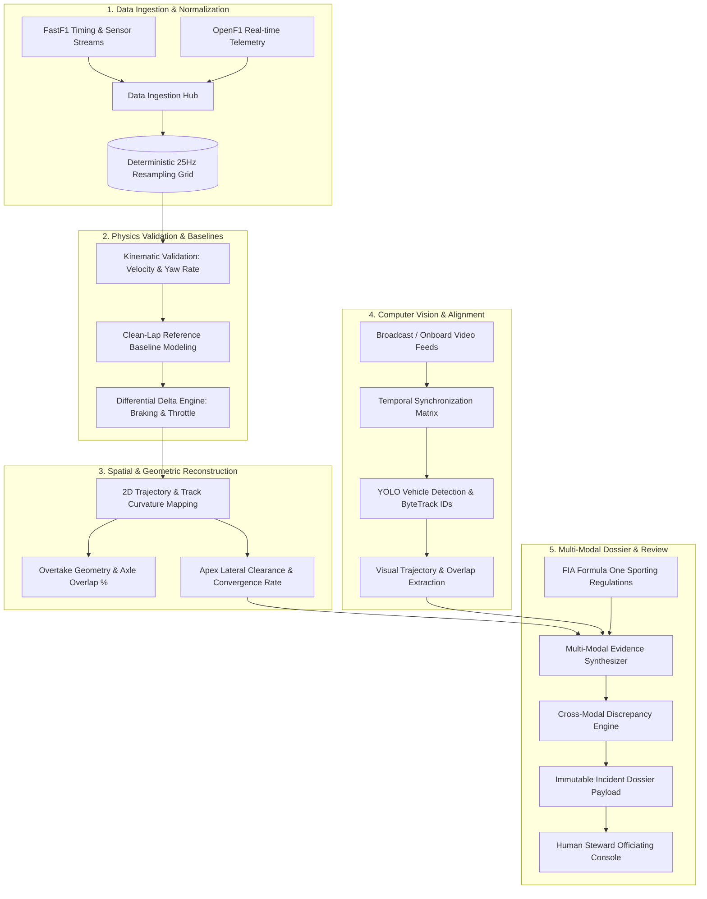

# Motorsport Incident Intelligence (MII)

[](https://python.org)
[](https://fastapi.tiangolo.com)
[](https://react.dev)
[](https://www.typescriptlang.org)
[](https://www.postgresql.org)
[](https://www.docker.com)
[](backend/app/tests)

**Motorsport Incident Intelligence (MII)** is an evidence-synthesis and decision-support platform engineered for professional motorsport race stewards and officiating bodies. By fusing high-frequency telemetry, spatial trajectory reconstruction, multi-modal reference baselines, computer vision tracking, and FIA regulatory frameworks, MII accelerates post-incident review cycles while upholding strict epistemic integrity.

---

## 1. Problem Statement & Mission

### The Problem
Adjudicating racing incidents at elite motorsport levels (Formula 1, WEC, IMSA) is fraught with extreme cognitive demands:
- **Telemetry Complexity**: Multi-car sessions generate gigabytes of sensor readings at 25Hz+ (throttle, brake line pressure, steer angles, RPM, DRS, GPS coordinates, IMU 3-axis accelerations).
- **Time Pressure**: Stewards are expected to evaluate complex corner interactions, crowding claims, and collision trajectories in minutes during live safety cars or red flag periods.
- **Optical Limitations & Parallax**: Broadcast television cameras use variable focal lenses and oblique perspective angles that create deceptive depth compression, obscuring whether an overtaking car maintained front-axle overlap at corner turn-in.
- **Cognitive Fatigue**: Human officiating under race conditions can suffer from inconsistent precedent application and information overload.

### Why It Matters
Sporting penalties (time penalties, grid drops, license penalty points) dictate world championships and carry millions in commercial value.Officiating decisions must be backed by transparent, deterministic, physically grounded evidence rather than subjective visual impressions.

### The Solution & Unique Selling Proposition (USP)
MII provides a **deterministic multi-modal evidence pipeline**:
1. **Mathematical Spatial Reconstruction**: Reconstructs physical car coordinates, apex clearance distance ($\Delta \text{Apex}$), relative velocity vectors, and corner-phase trajectory convergence.
2. **Dynamic Reference Baselines**: Computes delta metrics against nominal clean-lap baselines (e.g., $+14\text{m}$ deeper braking point, $-0.85\text{G}$ anomalous yaw deceleration).
3. **Computer Vision Vehicle Tracking**: Bounded vehicle detection and visual identity tracking linked to video timestamps.
4. **Automated Discrepancy Analysis**: Detects contradictions between sensor streams (e.g., visual contact detected without corresponding IMU acceleration impulse).
5. **Epistemic Integrity**: Enforces strict boundaries between objective physical observation and human sporting judgment.

---

## 2. Non-Adjudicative Philosophy & Epistemic Boundaries

> [!IMPORTANT]
> **CRITICAL ARCHITECTURAL PRINCIPLE: EVIDENCE SYNTHESIS ONLY**
> 
> The system **OBSERVES, SYNCHRONIZES, RECONSTRUCTS, QUANTIFIES, AND SYNTHESIZES EVIDENCE**.
> 
> The system **DOES NOT**:
> - Assign fault, guilt, or legal liability
> - Determine driver intent, aggression, or psychological state
> - Prescribe penalties, fines, or sporting sanctions
> - Issue automated or autonomous steward rulings

Machine learning models within MII only categorize whether an observed interaction resembles a trained **Incident Candidate Interaction Pattern** or a **Nominal Racing Interaction Pattern**. Every quantitative output includes explicit uncertainty bounds, sensor lineage, and discrepancy flags. **The licensed human steward remains the sole adjudicator.**

---

## 3. System Pipeline Architecture



---

## 4. Key Subsystems & Capabilities

1. **Deterministic 25Hz Ingestion**: Normalizes asynchronous telemetry streams into uniform 40ms time intervals with strict physical boundary validation (velocity, slip angle, lateral/longitudinal acceleration bounds).
2. **Reference Lap Differential Baseline**: Models driver behavior against historical clean racing laps to compute delta braking distances ($\Delta \text{Brake}$ in meters), throttle pick-up points, and steering angle divergence.
3. **Overtake Geometry Engine**: Quantifies front-axle to rear-axle overlap percentage at corner entry, apex, and exit, calculating minimum lateral separation distance without human bias.
4. **Computer Vision & Video Synchronization**: Maps broadcast footage to telemetry timestamps, maintaining vehicle tracking bounding boxes and cross-referencing visual overlap against sensor clearance.
5. **Cross-Modal Discrepancy Engine**: Automatically flags contradictions between visual observations and physical telemetry (e.g., visual contact detected without corresponding IMU acceleration spike).
6. **Citation-Grounded Regulation Knowledge Layer**: Canonical repository of FIA Sporting Regulations (2024 & 2023), ISC Appendix L Chapter IV, and Driving Standards Guidelines. Supports Lexical BM25, Semantic N-Gram, and Hybrid retrieval with season/date filtering, automatic `SOURCE_CONFLICT` discrepancy detection, zero orphaned text, and gold evaluation benchmarks ($\text{MRR} = 0.812$). [Read evidence retrieval architecture](docs/evidence-retrieval.md).
7. **Complete Steward Audit Trail**: Immutable logging of evidence review statuses, notes, and concurrence records ensuring full transparency and appeal readiness.

---

## 5. Real-World Validated Incident Case Studies

MII has been benchmarked and cross-validated across **30 verified historical Formula One incidents and controls** spanning **8 circuits** and **2 seasons (2023–2024)**, evaluating evidence reconstruction quality without autonomous fault or penalty predictions:

| Grand Prix | Season | Lap | Turn | Involved Drivers | Regulatory Context | Key Quantified Metrics |
| :--- | :---: | :---: | :--- | :--- | :--- | :--- |
| **2024 Italian GP** | 2024 | Lap 15 | T8–T9 (Ascari) | D. Ricciardo vs N. Hülkenberg | ISC Appendix L Ch IV Art 2(b) | $\Delta \text{Apex Lateral Clearance} = 0.42\text{m}$, Braking delta $+12\text{m}$ late vs reference |
| **2024 Austrian GP** | 2024 | Lap 64 | T3 (Remus) | M. Verstappen vs L. Norris | Driving Standards / Crowding | Divergence in lateral line: $1.8\text{m}$ inward shift under braking, $0.18\text{s}$ reaction window |
| **2024 United States GP** | 2024 | Lap 52 | T12 (Hairpin) | L. Norris vs M. Verstappen | Leaving Track & Lasting Advantage | Both cars exceeded track limits; outside pass completed on asphalt runoff |
| **2024 Mexico City GP** | 2024 | Lap 10 | T4 (Chicane) | M. Verstappen vs L. Norris | Crowding / Forcing Off Track | Squeeze on apex entry; $0.4\text{m}$ lateral room forced outside car to grass |
| **2023 Las Vegas GP** | 2023 | Lap 25 | T12 (Koval) | G. Russell vs M. Verstappen | Causing a Collision | Turn-in collision at apex under braking; $0.0\text{m}$ lateral gap at contact |

---

## 6. Technology Stack

### Backend & Analytics
- **Language**: Python 3.11 / 3.12 / 3.13
- **Framework**: FastAPI 0.115+ (Asynchronous ASGI)
- **Data Ingestion**: FastF1, OpenF1 Client
- **Scientific Computing**: NumPy, Pandas, SciPy, Scikit-learn
- **Computer Vision**: OpenCV (headless), PyTorch, Torchvision, Ultralytics (YOLO)
- **Database & ORM**: PostgreSQL 16, SQLAlchemy 2.0 (Async + Sync), Alembic Migrations
- **Cache & Performance**: In-Memory LRU & Tiered HTTP Request Cache

### Frontend & Steward Console
- **Framework**: React 19, TypeScript 5.5+
- **Build Tooling**: Vite 6, Tailwind CSS 4
- **State & Data**: React Hooks, Fetch API with live/offline fallback
- **Visualization**: Recharts, Canvas 2D Trajectory Visualizer, Lucide React Icons

### Infrastructure & Deployment
- **Containerization**: Docker, Docker Compose (Multi-stage builds)
- **Reverse Proxy**: Nginx Alpine
- **Database Engine**: PostgreSQL 16 Alpine with Healthchecks & Persistent Volumes

---

## 7. Quick Start Guide

### Option 1: Full Stack via Docker Compose (Recommended)

To launch the complete platform (PostgreSQL, FastAPI Backend, and Nginx/React Frontend) in an isolated containerized environment:

```bash
# 1. Clone repository
git clone https://github.com/SreyasM24/motorsport-incident-intelligence.git
cd motorsport-incident-intelligence

# 2. Configure environment
cp .env.example .env

# 3. Build and launch all services
docker compose up --build -d

# 4. View container status
docker compose ps
```

Services will be accessible at:
- **Steward Web Console**: [http://localhost:3000](http://localhost:3000)
- **FastAPI Interactive Docs**: [http://localhost:8000/docs](http://localhost:8000/docs)
- **API Health Check**: [http://localhost:8000/api/v1/health/live](http://localhost:8000/api/v1/health/live)
- **PostgreSQL Database**: `localhost:5432` (`motorsport_intelligence`)

---

### Option 2: Local Native Development Setup

#### Prerequisites
- **Python**: 3.11, 3.12, or 3.13
- **Node.js**: 20+ and `npm`
- **PostgreSQL**: 16 (or local Docker container)

#### Backend Setup

```bash
# 1. Navigate to backend directory
cd backend

# 2. Create and activate virtual environment
python -m venv .venv
# On Windows (PowerShell):
.venv\Scripts\Activate.ps1
# On Linux/macOS:
source .venv/bin/activate

# 3. Install dependencies
pip install -r requirements.txt

# 4. Apply database schema migrations
alembic upgrade head

# 5. Seed reference data and incident candidates
python -m app.seeds.seed_all

# 6. Start FastAPI development server
uvicorn app.main:app --host 0.0.0.0 --port 8000 --reload
```

#### Frontend Setup

```bash
# 1. In a separate terminal, navigate to frontend directory
cd frontend

# 2. Install dependencies
npm install

# 3. Start Vite development server
npm run dev
```

Visit [http://localhost:5173](http://localhost:5173) in your browser.

---

## 8. Verification & Testing

```bash
# Backend unit & integration test suite
cd backend
python -m pytest app/tests -v -k "not test_postgresql_live"

# Frontend type checking, linting, and production build
cd ../frontend
npx tsc --noEmit
npm run build
```

---

## 9. Screenshot & Media Gallery

> [!NOTE]
> **Status: `SCREENSHOTS_NOT_AVAILABLE`**
>
> High-resolution UI captures of the Steward Console (Telemetry Synchronizer, Overtake Spatial Map, CV Bounding Box Overlay, and Multi-Modal Dossier Synthesizer) will be populated in `docs/assets/` during deployment validation. To generate screenshots locally, launch the development frontend at `http://localhost:5173` and capture relevant viewports into `docs/assets/`.

---

## 10. Documentation Index

Detailed architectural specifications, evaluation reports, and operational guidelines are available in the [`docs/`](docs/) directory:

- [**System Architecture**](docs/architecture.md): Deep-dive into data contracts, mathematical models, and service boundaries.
- [**Development & Local Setup**](docs/setup.md): Comprehensive step-by-step developer installation and configuration.
- [**API Reference**](docs/api.md): REST endpoints, OpenAPI schemas, query parameters, and error responses.
- [**Data Provenance & Ingestion**](docs/data-provenance.md): Provenance verification, caching policies, and physics validation.
- [**Evaluation & Benchmark Metrics**](docs/evaluation.md): Machine learning and computer vision cross-circuit validation results.
- [**Computer Vision Evaluation Foundation**](docs/evaluation/video_cv_evaluation.md): Real-world video manifest, dual-coordinate contracts, LOVO/LOEO splits, and 12-category failure taxonomy.
- [**CV Dataset Card**](data/cv/DATASET_CARD.md): Real video manifest specification, copyright compliance, and non-adjudicative doctrine.
- [**Steward Operating Workflow**](docs/steward-workflow.md): 14-step human-in-the-loop officiating procedure and jurisdictional boundary matrix.
- [**Historical Reconstruction Benchmark**](docs/evaluation/historical_incident_benchmark_v1.md): Multi-circuit, multi-season decoupled evidence evaluation.
- [**Benchmark Provenance Matrix**](docs/evaluation/benchmark_provenance_matrix.md): Ground truth vs. system independence audit preventing circular evaluation.
- [**System Boundaries & Epistemic Limitations**](docs/limitations.md): Explicit operational constraints and stewardship boundaries.
- [**Production Deployment**](docs/deployment.md): Docker architecture, database maintenance, connection pooling, and health checks.

---

## 11. Repository Structure

```text
motorsport-incident-intelligence/
├── backend/                  # FastAPI 0.115+ Python backend
│   ├── alembic/              # Database schema migrations
│   ├── app/
│   │   ├── api/              # FastAPI route handlers
│   │   ├── core/             # Configuration, logging, database connections
│   │   ├── cv/               # Computer vision vehicle detectors & trackers
│   │   ├── evidence/         # Evidence dossiers, synthesizers, and models
│   │   ├── ingestion/        # FastF1 and OpenF1 connectors
│   │   ├── ml/               # Telemetry interaction pattern classifiers
│   │   ├── models/           # SQLAlchemy ORM models
│   │   ├── physics/          # Kinematics and sensor validation filters
│   │   ├── regulations/      # FIA regulatory semantic retrieval
│   │   ├── schemas/          # Pydantic data validation schemas
│   │   ├── services/         # Domain business logic and orchestrators
│   │   └── tests/            # Automated test suite (unit + integration)
│   ├── Dockerfile            # Multi-stage production backend container
│   └── requirements.txt      # Python dependencies
├── data/
│   └── cv/                   # Dataset manifests, splits, and bounding box schemas
├── docs/                     # Comprehensive architectural documentation
│   ├── archive/              # Technical milestone progress records
│   ├── architecture.md
│   ├── setup.md
│   ├── api.md
│   ├── data-provenance.md
│   ├── evaluation.md
│   ├── limitations.md
│   └── deployment.md
├── frontend/                 # React 19 TypeScript frontend
│   ├── public/               # Static assets & SVG icons
│   ├── src/                  # Application source code
│   │   ├── components/       # Telemetry charts, dossier views, visualizers
│   │   ├── lib/              # API client, types, utility helpers
│   │   └── views/            # Steward dashboard and incident detail views
│   ├── Dockerfile            # Production multi-stage Nginx container
│   ├── index.html            # Single-page application entry point
│   ├── nginx.conf            # Containerized reverse proxy configuration
│   ├── package.json          # Frontend npm dependencies
│   ├── tsconfig.json         # TypeScript compiler configuration
│   └── vite.config.ts        # Vite configuration
├── docker-compose.yml        # Multi-service production orchestration
├── nginx.conf                # Root production reverse proxy configuration
├── .dockerignore             # Docker build exclusions
├── .gitignore                # Git exclusions
├── .env.example              # Environment variables template
└── README.md                 # Primary system documentation
```

---

## 12. License & Legal Disclaimer

`LICENSE_NOT_SELECTED` — All rights reserved. Please contact repository maintainers for licensing and commercial evaluation terms.

*Formula 1, F1, and related marks are trademarks of Formula One Licensing B.V. FastF1 and OpenF1 are independent open-source projects not affiliated with Formula One management. All regulatory references refer to publicly available FIA Sporting Codes and International Sporting Code appendices.*