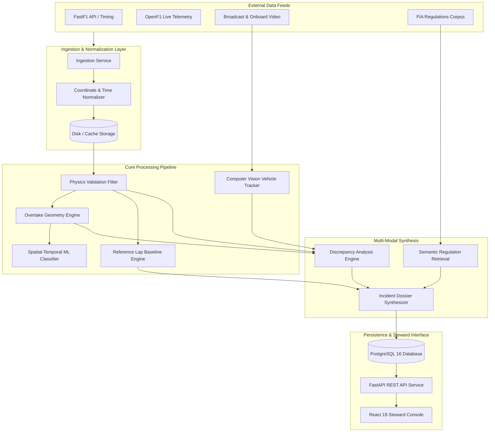

# System Architecture Specification

## Overview

Motorsport Incident Intelligence (MII) is engineered to process heterogeneous motorsport data streams—including physical car sensor telemetry, spatial GPS positioning, video camera footage, and regulatory frameworks—and synthesize them into an objective, quantitative evidence dossier for human race stewards.

This document describes the architectural layers, data contracts, and cross-service boundaries that form the system.

---

## Architectural Principles

1. **Strict Epistemic Boundaries**: The system measures, computes, and aligns physical and visual phenomena. It deliberately excludes fault classifiers, blame assignment algorithms, and automated penalty generators.
2. **Deterministic Preprocessing**: All multi-rate sensor feeds (from 4Hz GPS to 100Hz engine telemetry) are converted to a uniform 25Hz temporal grid using bounded interpolation algorithms.
3. **Multi-Modal Verification**: Any critical incident observation (e.g., trajectory divergence or sudden deceleration) must be independently cross-verified against multiple orthogonal sources (telemetry, geometry, visual tracking).
4. **Reproducible Provenance**: Every generated dossier includes cryptographic hashes of input data, model versions, and configuration parameters.

---

## High-Level Topology

---

## Core Subsystems

### 1. Ingestion & Normalization Layer
- **FastF1 Adapter**: Interfaces with official Formula One timing databases. Handles historical sessions, lap times, tire compound data, and weather records.
- **OpenF1 Adapter**: Consumes real-time and replay telemetry streams for high-frequency throttle, brake, RPM, gear, and DRS metrics.
- **Temporal Synchronizer**: Converts disparate UTC and session timestamps into a normalized monotonic elapsed time framework ($t_{\text{incident}} \pm \Delta t$).

### 2. Telemetry Preprocessing & Physics Validation
Raw automotive sensors are susceptible to packet drops, GPS multipath interference, and quantization artifacts. The physics validation module filters anomalies using domain kinematic constraints:
- Maximum lateral acceleration: $a_{\text{lat}} \le 6.5g$
- Maximum longitudinal deceleration: $a_{\text{long}} \ge -6.5g$
- Slip angle limits and speed-dependent turning radius constraints
- Gaps $> 1000\text{ms}$ are flagged with uncertainty annotations rather than blindly interpolated.

### 3. Spatial & Geometric Reconstruction
- **Trajectory Interpolation**: Employs cubic Hermite splines to generate continuous vehicle center-of-mass trajectories $(x(t), y(t), z(t))$ and instantaneous yaw $\psi(t)$.
- **Apex & Corner Phase Mapping**: Partitions cornering maneuvers into Entry, Apex, and Exit phases based on track center-line curvature and lateral acceleration peaks.
- **Overlap & Clearance Computation**:
  $$\text{Overlap}_{\%} = \frac{\text{Projected Overlap Length}}{\text{Car Length (5.63m)}} \times 100$$
  Tracks lateral clearance $\Delta d_{\text{lat}}(t)$ and longitudinal delta $\Delta s_{\text{long}}(t)$ across each corner phase.

### 4. Machine Learning Interaction Pattern Analysis
- **Architecture**: Lightweight Spatial-Temporal 1D Convolutional Neural Network (1D-CNN) / Gradient-Boosted Trees.
- **Features**: Time-series windows ($[-2.0\text{s}, +2.0\text{s}]$) of relative lateral distance, delta yaw velocity, steering rate differential, and braking delta vs reference.
- **Output**: An empirical probability vector indicating whether the interaction pattern matches historical racing disputes versus nominal non-incident maneuvers.

### 5. Computer Vision & Visual Tracking
- **Detector**: YOLOv8 nano/small optimized for motorsport liveries and car silhouettes.
- **Tracker**: ByteTrack association matching Kalman filter motion predictions with high-IoU detections.
- **Visual Identity Engine**: Maps detected bounding boxes to driver numbers and car liveries.
- **Optical Clearance**: Quantifies bounding-box pixel distance and cross-references with GPS-derived lateral clearance.

### 6. Multi-Modal Discrepancy & Synthesis
The synthesis engine compares outputs from independent modalities to detect conflicts:
- *Example Conflict*: Telemetry shows $0.0g$ sudden lateral impulse, but visual tracker reports high-velocity bounding-box collision $\to$ **Flagged as Sensor Discrepancy (Possible Grazing Contact or Tracking Artefact)**.
- *Example Conflict*: Driver claims brake failure, but sensor logs indicate $100\%$ hydraulic line pressure with proportional deceleration $\to$ **Flagged as Telemetry-Statement Contradiction**.

### 7. Regulatory Knowledge Retrieval
An embedded vector index of the FIA Formula One Sporting Regulations, International Sporting Code (Appendix L, Chapter IV), and annual Steward Guidelines. Queries match observed geometric metrics (e.g., "overtake inside apex overlap $< 50\%$") with relevant articles.

---

## Database Architecture

MII utilizes PostgreSQL 16 managed through SQLAlchemy ORM and Alembic migrations:

| Table | Purpose |
| :--- | :--- |
| `sessions` | Grand Prix event metadata, circuit layout, conditions |
| `incident_candidates` | Detected candidate moments flagged for potential review |
| `telemetry_frames` | 25Hz resampled sensor records for involved cars |
| `overtake_geometries` | Phase-by-phase overlap, clearances, and trajectory angles |
| `reference_baselines` | Delta metrics comparing incident laps to clean baseline laps |
| `video_alignments` | Video frame mappings and temporal synchronization offsets |
| `cv_detections` | Bounding box coordinates, tracker IDs, and class confidences |
| `evidence_dossiers` | Fully synthesized JSON evidence documents |
| `steward_reviews` | Human steward notes, confirmation status, and audit logs |

---

## Frontend Architecture

The steward interface is built as a single-page reactive application:
- **Modular Component Design**: Split-view synchronized telemetry graphs, interactive 2D canvas track maps, video scrubbers, and regulatory citation cards.
- **Unified Time Scrubbing**: Scrubbing the timeline synchronously updates video playback, 2D car positions, and telemetry cursor values.
- **Zero-Latency Client State**: Utilizes TanStack Query with in-memory caching to ensure instantaneous navigation between incident dossiers.
