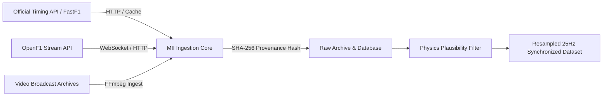

# Data Provenance and Quality Assurance

Reliability in motorsport stewarding requires unambiguous data lineage. Every measurement, time-series slice, and visual frame presented by the Motorsport Incident Intelligence (MII) platform is tracked from ingestion to final review.

---

## 1. Data Sources & Ingestion Pathways

### Primary Sources
1. **FastF1 (Official Live Timing Feed)**:
   - Provides sector times, lap count, tire compounds, and session-level telemetry tables.
   - Cached locally in an isolated SQLite / pickle cache (`data/cache/fastf1/`) to avoid rate limits and permit offline evaluation.
2. **OpenF1 (High-Frequency Vehicle Telemetry)**:
   - Streams car telemetry (throttle, brake, RPM, steer, DRS) and car positional coordinates ($x, y, z$) sampled at native hardware frequencies (~10Hz GPS, ~100Hz engine bus).
3. **Broadcast & Onboard Video**:
   - Synchronized MP4 footage matched to telemetry via session clock synchronization offsets.

---

## 2. Temporal Normalization & 25Hz Grid

Because individual sensors transmit data asynchronously at varying frequencies, direct comparison requires resampling onto a common temporal grid:

- **Target Frequency**: $25\text{Hz}$ ($\Delta t = 40\text{ms}$).
- **Interpolation Algorithm**: Akima piecewise cubic interpolation for continuous physical quantities (speed, throttle, brake pressure) and linear spherical interpolation (SLERP) for orientation/yaw angles.
- **Gap Limiting**: If a telemetry gap exceeds $1000\text{ms}$, the system does not interpolate across the void. Instead, it generates a `DATA_GAP_FLAG` and assigns an elevated uncertainty margin to derived metrics in that window.

---

## 3. Physical Boundary & Plausibility Validation

Prior to downstream analysis, telemetry traces pass through a physical feasibility filter:

| Parameter | Feasible Operating Bounds | Flagged Condition |
| :--- | :--- | :--- |
| **Speed ($v$)** | $0 \le v \le 375\text{ km/h}$ | Sensor dropout or wheel-spin anomaly |
| **Deceleration ($a_{\text{long}}$)** | $-6.5g \le a_{\text{long}} \le +2.5g$ | Unphysical telemetry jump |
| **Lateral Acceleration ($a_{\text{lat}}$)**| $|a_{\text{lat}}| \le 6.5g$ | Kinematically implausible cornering |
| **Steering Delta ($\Delta \theta / \Delta t$)** | $\le 720^\circ/\text{s}$ | Potentially severed CAN bus frame |
| **Throttle / Brake Correlation** | $P(\text{Throttle} > 80\% \land \text{Brake} > 80\%) \le 0.2\text{s}$ | Left-foot braking transition or sensor stuck |

Traces failing these filters are flagged with a low **Physical Plausibility Score** ($0.0 \le S_{\text{phys}} \le 1.0$), warning stewards of potential sensor inaccuracies.

---

## 4. Cryptographic Provenance Hashing

To ensure auditability, each generated dossier includes a cryptographic SHA-256 checksum computed over:
1. Normalized telemetry matrix values
2. Coordinate reference frames
3. Model configuration and version numbers
4. Video synchronization offset ($T_{\text{offset}}$)

$$\text{Provenance Hash} = \text{SHA256}(\text{TelemetryData} \mathbin{\Vert} \text{GeometryParams} \mathbin{\Vert} \text{ModelVersion})$$

If any underlying sensor record is modified post-hoc, the provenance hash changes, alerting the steward to a data integrity violation.

---

## 5. Synthetic Fixtures vs Real Race Data

During unit and integration testing, synthetic fixtures are utilized to verify pipeline math deterministically:
- Real session telemetry (e.g. 2024 Monza GP Lap 15, 2024 Austrian GP Lap 64) is reserved for integration tests and benchmark reports.
- All mock and synthetic test fixtures are clearly separated in `backend/app/tests/` and labelled with synthetic markers.
- No commercial broadcast footage or proprietary telemetry is redistributed in the repository.
