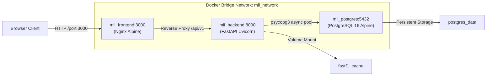

# Production Deployment Guide

This document details the configuration, deployment, and operational procedures for running the Motorsport Incident Intelligence (MII) platform in a secure, containerized production environment.

---

## 1. Container Topology

The production architecture is deployed via Docker Compose across three isolated containers:



---

## 2. Docker Compose Configuration Overview

The deployment definition is located in [`docker-compose.yml`](../docker-compose.yml):

- **`db` (PostgreSQL 16 Alpine)**:
  - Configured with healthchecks running `pg_isready -U postgres`.
  - Backed by named volume `postgres_data` for transaction log and data persistence.
- **`backend` (FastAPI + Python 3.12)**:
  - Multi-stage build minimizing image footprint.
  - Automatically runs Alembic migrations before starting ASGI server.
  - Exposes port `8000`.
- **`frontend` (React 19 + Nginx Alpine)**:
  - Multi-stage build (Node 20 builder $\to$ unprivileged Nginx runtime).
  - Routes `/api/v1` and `/health` requests to `backend:8000`.
  - Exposes port `3000`.

---

## 3. Deployment Procedure

### Step 1: Host Preparation
Install Docker Engine and Docker Compose on your host machine:
```bash
sudo apt-get update && sudo apt-get install -y docker.io docker-compose-v2
```

### Step 2: Environment Configuration
Create the production environment file:
```bash
cp .env.example .env
```
Ensure strong passwords for `DATABASE_URL` and specify your domain in `CORS_ORIGINS`.

### Step 3: Launch Services
```bash
docker compose up --build -d
```

### Step 4: Verify Health Status
```bash
docker compose ps
```
Inspect health output:
```text
NAME           IMAGE                                    COMMAND                  SERVICE    STATUS
mii_postgres   postgres:16-alpine                       "docker-entrypoint.s…"   db         Up (healthy)
mii_backend    motorsport-incident-intelligence-backend "alembic upgrade head…"  backend    Up (healthy)
mii_frontend   motorsport-incident-intelligence-frontend"nginx -g 'daemon of…"   frontend   Up (healthy)
```

---

## 4. Database Maintenance & Backup

### Automated Database Backup
To create a consistent SQL dump of the database:
```bash
docker compose exec db pg_dump -U postgres motorsport_intelligence > backup_$(date +%Y%m%d_%H%M%S).sql
```

### Database Restore
```bash
docker compose exec -T db psql -U postgres motorsport_intelligence < backup_file.sql
```

### Running Schema Migrations
Alembic migrations run automatically on container startup. To apply migrations manually:
```bash
docker compose exec backend alembic upgrade head
```

---

## 5. Security & Network Hardening

1. **Least-Privilege Containers**: Both frontend and backend containers execute under non-root users (`nginx` and dedicated `appuser`).
2. **Reverse Proxy Isolation**: Direct backend access is restricted within the Docker bridge network. Only Nginx on port `3000` (or `80`/`443` in production) is exposed to incoming public traffic.
3. **No Secrets in Images**: All credentials and API tokens are injected exclusively via runtime environment variables and excluded from image layers.
