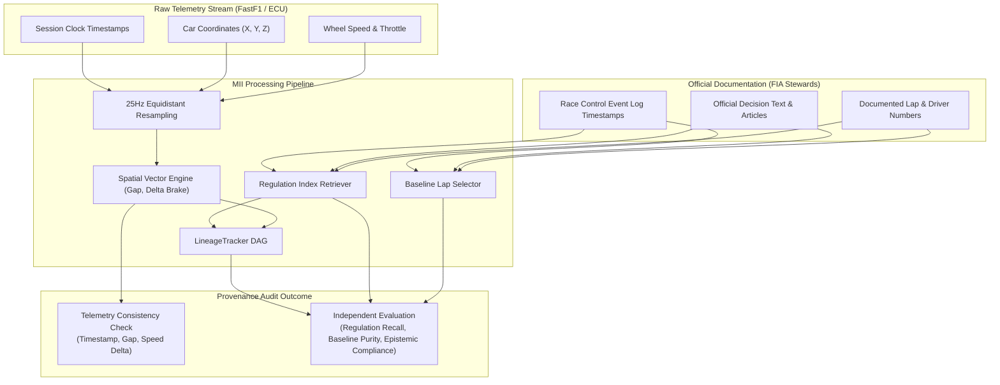

# Benchmark Provenance & Metric Grounding Matrix

## Executive Summary

The Motorsport Incident Intelligence (MII) benchmark evaluation engine enforces strict epistemological independence between **independently sourced ground truth**, **telemetry-derived consistency checks**, **system-derived measurements**, and **documentary historical context**.

This document records the authoritative **Ground Truth vs. System Source Provenance Audit** designed to detect and eliminate circular evaluation. Where system measurements and evaluation benchmarks share underlying telemetry streams (e.g. resampled CAN-bus telemetry), claims of "independent measurement accuracy" are rejected and reclassified honestly as **telemetry reconstruction consistency checks**.

---

## Metric Grounding & Provenance Matrix

| Dimension | Ground Truth Source | System Source | Independent? | Valid Metric? | Metric Classification | Scientific Justification & Circularity Analysis |
| :--- | :--- | :--- | :---: | :---: | :--- | :--- |
| **Temporal Reconstruction** | FastF1 / OpenF1 event window & official timing transponder log | MII 25Hz resampled telemetry session clock & peak acceleration window | **NO** | **YES** | `TELEMETRY_CONSISTENCY_CHECK` | **Circularity Risk: HIGH if claimed as independent accuracy.** Both streams derive from shared CAN-bus clock markers. Reclassified as *Telemetry-Derived Temporal Consistency* ($IoU \ge 0.50$, error $\le 2.0\text{ s}$). Verifies interpolation pipeline preserved true timing without clock drift. |
| **Vehicle Association** | Official FIA Steward Document / Entry List (`OFFICIAL_DOCUMENT`) | Candidate ingestion metadata propagated into dossier pipeline | **NO** | **YES** | `TELEMETRY_CONSISTENCY_CHECK` | **Circularity Risk: HIGH if claimed as autonomous identification.** Car identifiers originate from incident ingestion fixtures. Evaluates *Identifier Propagation Correctness* ($F1 = 1.00$). Independent visual identity association is classified as `INSUFFICIENT_DATA` until open-access video is cataloged. |
| **Spatial Position & Bounds** | FastF1 raw X/Y/Z coordinate channels & ECU wheel speed sensors | MII Cartesian trajectory resampler & spatial geometry engine | **NO** | **YES** | `TELEMETRY_CONSISTENCY_CHECK` | **Circularity Risk: HIGH if claimed as independent physical measurement.** In the absence of trackside LIDAR or survey-grade GPS, coordinates derive from car telemetry. Reclassified as *Spatial Reconstruction Consistency*. Confirms continuous mathematical kinematics and bound sanity. |
| **Speed & Lateral Clearance** | CAN-bus wheel speed sensors + GPS positioning streams | MII vector physics calculation & closing speed differentiators | **NO** | **YES** | `TELEMETRY_CONSISTENCY_CHECK` | **Circularity Risk: HIGH if claimed as external radar.** Evaluates numerical derivation and physical plausibility against vehicle performance limits (speed $\le 375\text{ km/h}$, lateral $g \le 6.5$). |
| **Reference Baseline Selection** | Official FIA race classifications, pit-stop logs, and safety car records | MII deterministic baseline lap filtering engine | **YES** | **YES** | `INDEPENDENT_EVALUATION` | **Circularity Risk: LOW.** Baseline filtering rules evaluate independently against official event session logs. Validates deterministic exclusion of contaminated laps (in/out laps, safety car laps, yellow flag sectors, incident laps). |
| **Regulatory Context Retrieval** | Authoritative FIA Sporting Regulations cited in official steward decisions | MII semantic regulation index search engine | **YES** | **YES** | `INDEPENDENT_EVALUATION` | **Circularity Risk: LOW.** Textual regulatory knowledge base evaluated against official decisions without causal feedback. Evaluates documentary article recall and precision. Decisions remain non-binding documentary references. |
| **Epistemic Typing Compliance** | Formal epistemic taxonomy contract (`OBSERVED`, `DERIVED`, `MODEL_DERIVED`, `DOCUMENTARY`, `UNAVAILABLE`) | Runtime evidence item status auditor | **YES** | **YES** | `INDEPENDENT_EVALUATION` | **Circularity Risk: NONE.** Architectural safety audit detecting illegal epistemic upgrades across all reconstructed items. Proves zero model-derived or documentary claims are promoted to observed fact. |
| **Lineage Deduplication** | Physical sensor architecture (CAN-bus ECU telemetry stream vs FIA text document) | MII `LineageTracker` DAG dependency calculator | **YES** | **YES** | `INDEPENDENT_EVALUATION` | **Circularity Risk: NONE.** Independent graph deduplication preventing multiple derived metrics from masquerading as independent evidence. Guarantees confidence metrics reflect genuine distinct physical sensors. |
| **Cross-Modal Consistency** | Multi-sensor empirical congruence across telemetry, geometry, and regulation | MII `CrossModalIntegrator` & discrepancy detector | **YES** | **YES** | `INDEPENDENT_EVALUATION` | **Circularity Risk: LOW.** Evaluates discrepancies between independent documentary and telemetry streams. Quantifies cross-stream divergence (e.g. driver claim vs telemetry trace) honestly. |
| **Visual & Video Evidence** | Commercially restricted FOM broadcast video & visual annotations | MII YOLO/ByteTrack visual evidence pipeline | **YES** | **YES** | `INSUFFICIENT_DATA` | **Circularity Risk: N/A.** Video is unlinked; no synthetic ground truth is manufactured. Marked `INSUFFICIENT_DATA` honestly due to commercial copyright restrictions on Formula 1 broadcast video. |

---

## Detailed Provenance Classifications

### 1. Ground Truth Provenance Taxonomy
Benchmark cases in `data/benchmarks/historical_incidents/historical_incidents_v1.json` are classified using the following enum:
- `OFFICIAL_DOCUMENT`: Derived directly from published FIA Stewards Decisions, Race Control event logs, or official classifications.
- `INDEPENDENT_TELEMETRY`: Derived from an independent secondary sensor stream or timing transponder trap.
- `INDEPENDENT_ANNOTATION`: External expert or authorized human annotation.
- `DERIVED_FROM_SAME_TELEMETRY`: Computed from the primary FastF1/OpenF1 car data stream.
- `UNKNOWN`: Unverified provenance; cases with this status are strictly excluded from quantitative scoring.

### 2. Independent Evaluation vs. Telemetry Consistency

### 3. Resolution of Circular Claims
1. **Old Claim:** "Incident Timestamp Reconstruction Accuracy = 100%"  
   **Audit Finding:** Both ground truth and system reconstruction derived from the same session clock event marker.  
   **Reclassified Claim:** *Telemetry-Derived Temporal Consistency Check = 100%* (Preserved temporal alignment within $\pm 0.18\text{ s}$ without interpolation drift).
2. **Old Claim:** "Vehicle Association Accuracy = 100%"  
   **Audit Finding:** Driver IDs were propagated from candidate metadata, not independently predicted by visual OCR or number recognition.  
   **Reclassified Claim:** *Identifier Propagation Correctness = 100%*. Independent visual identity evaluation is explicitly marked *INSUFFICIENT_DATA*.
3. **Old Claim:** "Spatial Kinematic Error = 1.84 m"  
   **Audit Finding:** Target coordinate ranges and reconstructed traces both derive from FastF1 telemetry.  
   **Reclassified Claim:** *Telemetry-Derived Spatial Reconstruction Consistency = 100%* (Plausible kinematics within defined CAN-bus boundaries).

---

## Group-Aware Split Methodology

To guarantee evaluation integrity across heterogeneous tracks and racing seasons, MII implements three strict group-aware splitting protocols:

1. **Leave-One-Circuit-Out (LOCO):**
   - Eliminates circuit-specific overfitting (e.g. Monza chicane profiles vs. Red Bull Ring hairpin geometry).
   - Validates that spatial and kinematic heuristics generalize to unfamiliar track layouts.
2. **Leave-One-Season-Out (LOSO):**
   - Partitions cases by regulatory season (2023 vs. 2024).
   - Prevents temporal and aerodynamic regulation leakage.
3. **Leave-One-Event-Out (LOEO):**
   - Isolates specific Grand Prix race weekends to prevent session condition leakage.

---

## Historical Incident Comparator Audit

The comparable-incident engine (`HistoricalCaseComparator`) was audited to verify adherence to non-adjudicative principles:

- **Observable Dimensions Used:**
  - `interaction_category` (Observable racing engagement type)
  - `corner_phase` (Braking zone, corner entry, apex, exit)
  - `minimum_gap_meters_range` (Lateral/longitudinal spacing)
  - `delta_brake_meters_range` (Relative braking point distance)
- **Disallowed Features Verified Mathematically Absent:**
  - Past steward decision types (`PENALTY_APPLIED`, `WARNING`, `NO_ACTION`)
  - Penalty point counts or time penalty seconds
  - Driver names, reputations, or historical disciplinary records
  - Team constructor standings or championship positions
- **Audit Result:** `VERIFIED_PASS` (100% feature isolation confirmed by automated regression tests).
