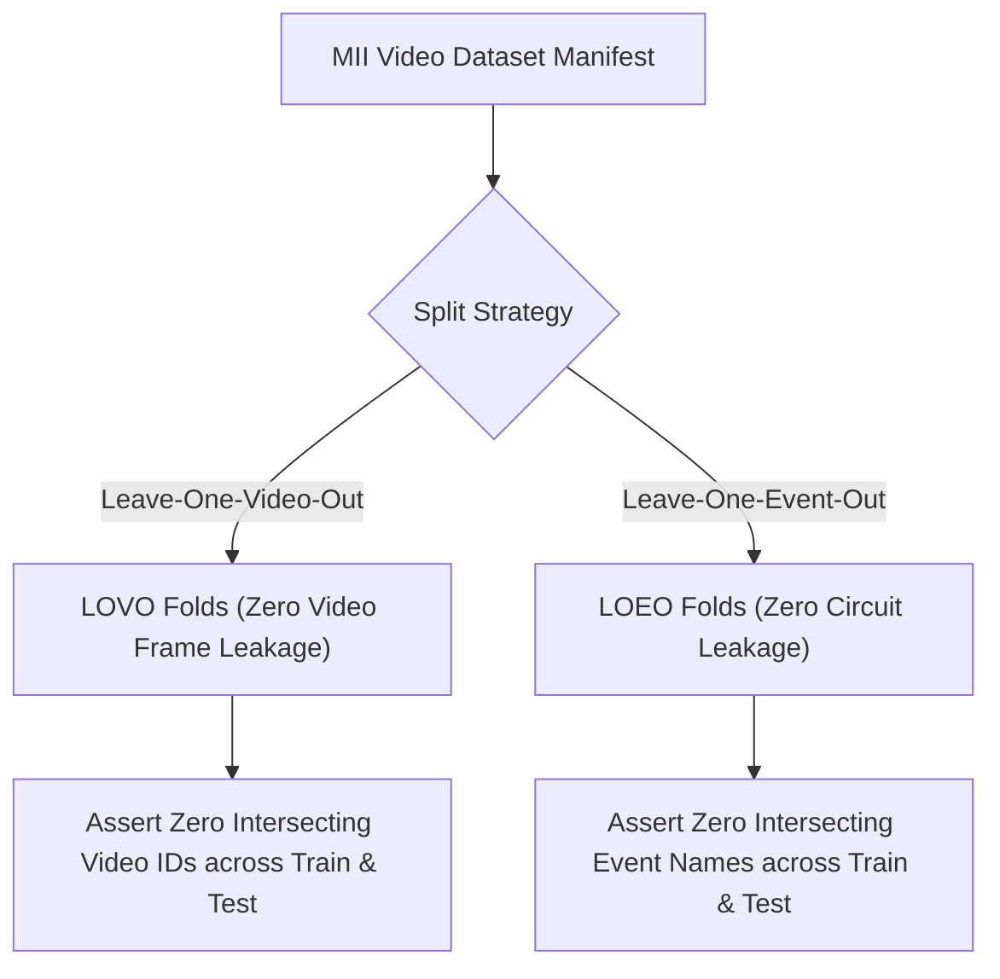

# Computer Vision Evaluation Foundation & Real-World Video Dataset Specification

**Module:** Motorsport Incident Intelligence — Computer Vision Subsystem  
**Specification:** Prompt 22 Technical Standard  
**Real-World Video Status:** `INSUFFICIENT_DATA` (Commercial FOM broadcast footage restricted; zero raw frames bundled)  
**Dataset Card:** [`data/cv/DATASET_CARD.md`](file:///C:/Users/malla/antigravity/Motorsport-Incident-Intelligence/data/cv/DATASET_CARD.md)  
**Manifest:** [`data/cv/real_video_manifest.json`](file:///C:/Users/malla/antigravity/Motorsport-Incident-Intelligence/data/cv/real_video_manifest.json)  

---

## 1. System Objective & Legal Guardrails

The Computer Vision subsystem of Motorsport Incident Intelligence (MII) provides descriptive visual evidence to augment high-frequency telemetry during steward inquiries.

### 1.1 Copyright Integrity & Real-World Video Status
- **Zero Copyright Infringement:** Formula One Management (FOM) broadcast television footage, onboard cameras, and trackside CCTV are protected under international commercial copyright. No broadcast footage is scraped, mirrored, or bundled in this repository.
- **Honest Metric Reporting:** The system does not fabricate evaluation scores on unlinked video feeds. When commercial broadcast footage is unbundled, the system explicitly reports:
  ```json
  "realWorldVideoStatus": "INSUFFICIENT_DATA"
  ```
- **Authorized Research Data:** Benchmark evaluations for object detection and tracking are grounded in authorized open datasets (such as F1TENTH Autonomous Racing, Indy Autonomous Challenge, and UA-DETRAC) alongside verified synthetic simulation fixtures.

### 1.2 Non-Adjudicative Epistemic Doctrine
- **Zero Guilt or Fault Determination:** Visual evidence is strictly descriptive decision support for human race stewards. The CV pipeline NEVER assigns driver fault, predicts sporting penalties, or determines collision liability.
- **Discrepancy as Evidence Quality Flag:** Spatial discrepancies between 2D camera projections and 2D telemetry track plans, or temporal offsets between visual contact and telemetry peak deceleration, represent sensor calibration uncertainty and optical perspective effects—**NEVER** driver wrongdoing.

---

## 2. Dataset Contract & Manifest Architecture

The canonical video manifest is stored at `data/cv/real_video_manifest.json`.

### 2.1 Manifest Schema
Each video entry is typed via `VideoDatasetRecord`:
```python
class VideoDatasetRecord(BaseModel):
    video_id: str
    series: str
    season: int
    event: str
    session: str
    camera_id: str
    source_type: VideoSourceType
    source_url: str
    license_status: str
    authorization_status: VideoAuthorizationStatus
    duration_seconds: float
    frame_rate: float
    resolution: str
    timestamp_reference: str
    timezone: str
    incident_case_ids: List[str]
    annotation_status: str
    split: str
    provenance: str
    content_hash: str
```

### 2.2 Authorization Taxonomy
- `AVAILABLE`: Fully licensed, verified, and accessible video.
- `AUTHORIZED`: Authorized open research or consortium dataset (e.g. F1TENTH CC-BY 4.0, IAC Apache 2.0).
- `UNAUTHORIZED`: Unauthorized broadcast rips or pirated streams (**Strict Invariant:** Excluded from all processing).
- `PENDING_REVIEW`: Awaiting formal legal verification.
- `UNAVAILABLE`: Commercially restricted broadcast video (FOM copyright).
- `SYNTHETIC`: Deterministic synthetic simulation fixture.

---

## 3. Annotation Pipeline & Quality Validation

### 3.1 Dual-Coordinate Framework
Annotations support both normalized $[0.0, 1.0]$ and absolute pixel coordinates:
- `to_normalized(frame_width, frame_height)`: Normalizes pixel coordinates with boundary clamping to $[0.0, 1.0]$.
- `to_pixel(frame_width, frame_height)`: Maps normalized ratios to integer pixels with frame dimension bounding.

### 3.2 Automated Validation Suite
The `validate_annotation` and `validate_annotation_sequence` functions enforce:
1. **Geometric Invariants:** $0.0 \le x_{min} < x_{max} \le 1.0$ and $0.0 \le y_{min} < y_{max} \le 1.0$.
2. **Dimension Clipping:** Pixel bounding boxes must lie strictly within image boundaries.
3. **Temporal Monotonicity:** Track observation timestamps within a sequence must be non-decreasing.
4. **Identity Uniqueness:** Duplicate track/object IDs within the same frame trigger an immediate validation exception.

---

## 4. Group-Aware Cross-Validation (LOVO & LOEO)

To prevent data leakage caused by adjacent video frames sharing visual features:



- **Leave-One-Video-Out (LOVO):** Partitions dataset such that all frames from a single video exist exclusively in either the train or test set.
- **Leave-One-Event-Out (LOEO):** Partitions dataset by Grand Prix venue, ensuring models generalize to unseen lighting, barrier geometry, and asphalt textures.

---

## 5. Computer Vision Failure Taxonomy (12 Categories)

| Category | Definition | Root Cause / Steward Impact |
| :--- | :--- | :--- |
| `DETECTION_MISS` | Vehicle unpredicted ($IoU < 0.50$) | Low contrast, motion blur, or unusual vehicle livery |
| `FALSE_DETECTION` | False positive prediction | Trackside advertising, sponsor boards, or tire marks |
| `OCCLUSION` | Vehicle obscured $>40\%$ | Intervening competitor car, barrier, or tire spray |
| `TRUNCATION` | Vehicle partially outside image frame | Car exiting camera field of view |
| `TRACK_FRAGMENTATION` | Single ground truth track broken into multiple IDs | Missed detections during high-speed rotation or turn |
| `ID_SWITCH` | Identity swapped between interacting cars | Close-proximity overlap during corner apex clash |
| `IDENTITY_UNAVAILABLE` | Driver identity unconfirmed | Absence of optical helmet/car number annotations |
| `TIMESTAMP_MISALIGNMENT` | Timecode mismatch with CAN-bus ($>\tau_{sync}$) | Broadcast transmission lag or clock drift |
| `CAMERA_GEOMETRY` | Severe perspective foreshortening | Monocular lens distortion along long straights |
| `INSUFFICIENT_RESOLUTION` | Vehicle bounding box area $< 0.01$ of frame | Distant camera zoom; cannot resolve wheel angle |
| `VIDEO_UNAVAILABLE` | Video stream unlinked or absent | FOM commercial broadcast copyright restriction |
| `OTHER` | Miscellaneous visual artifacts | Broadcast graphics overlay, safety car flashing beacons |

---

## 6. Independent Identity Attribution Contract

Attributing a visual bounding box to a specific driver code requires verifiable ground truth:
- If livery, car number, or onboard metadata annotations are not independently verified, the evaluation service outputs:
  ```json
  "identityMetrics": {
    "evaluationStatus": "INSUFFICIENT_DATA",
    "statement": "Driver identity evaluation requires authoritative camera metadata or helmet/car livery annotations."
  }
  ```
- **Integrity Rule:** 100% identity accuracy is never asserted from synthetic fixtures or inferred from telemetry positions.

---

## 7. Cross-Modal Temporal & Spatial Validation

The cross-modal engine assesses the correspondence between visual minimum distance and telemetry peak interaction:
- **Temporal Alignment:** Measures $|\Delta t| = |t_{vis} - t_{tel}|$. Tolerance $\tau \le 0.20s$.
- **Spatial Alignment:** Projects 3D/2D bounding box centroids onto the circuit track plane, evaluating spatial discrepancy against calibrated GPS/wheel-speed positions.
- **Non-Adjudicative Standard:** High spatial discrepancy indicates camera projection distortion or lens calibration limits—it does NOT mean a driver left the racing surface or caused contact.

---

## 8. REST API Endpoints

### 8.1 Dataset Catalog
`GET /api/v1/analysis/cv/dataset`
- Returns full real video manifest catalog, authorization statuses, series distributions, and dataset card metadata.

### 8.2 System-Wide Evaluation Suite
`GET /api/v1/analysis/cv/evaluation`
- Returns detection metrics, tracking continuity, identity attribution status (`INSUFFICIENT_DATA`), cross-modal disparity, 12-category failure taxonomy breakdown, and LOVO/LOEO split evaluations.

### 8.3 Incident-Specific Visual Sufficiency
`GET /api/v1/analysis/candidates/{candidate_id}/video/cv`
- Returns whether visual evidence is available (`SUFFICIENT`, `PARTIALLY_SUFFICIENT`, `INSUFFICIENT`, or `UNAVAILABLE`).
- For commercial cases without video, returns `VIDEO_EVIDENCE_UNAVAILABLE` and confirms telemetry as primary evidence.

---

## 9. AI Steward Assistant Integration

When queried regarding video or visual evidence:
- If video is unavailable (`REF-MONZA-01`, `CASE-HIST-*`), the assistant returns `VIDEO_EVIDENCE_UNAVAILABLE`, explains the FOM copyright constraints, and provides direct links to the primary telemetry and regulatory documents.
- If video is available (research or synthetic fixtures), the assistant highlights that visual detections are `MODEL_DERIVED`, identity confidence is bounded, and spatial discrepancies are evidence-quality flags rather than driver fault.
