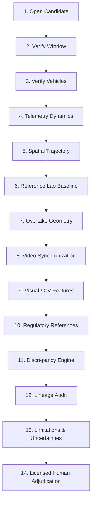

# Steward Operating Workflow & Evidence Review Protocol

This protocol defines the standardized operational sequence and epistemic boundaries for licensed motorsport stewards, race directors, and officiating panels utilizing the Motorsport Incident Intelligence (MII) platform.

---

## 1. Core Operating Philosophy & Epistemic Boundaries

> [!IMPORTANT]
> **CRITICAL OFFICIATING PRINCIPLE: DECISION SUPPORT, NOT AUTONOMOUS ADJUDICATION**
> 
> The Motorsport Incident Intelligence platform is an **objective evidence synthesis and spatial reconstruction system**.
> 
> The platform **OBSERVES, SYNCHRONIZES, RECONSTRUCTS, QUANTIFIES, AND CROSS-CHECKS EVIDENCE**.
> 
> The platform **DOES NOT**:
> - Assign sporting fault, guilt, or legal liability.
> - Prescribe penalties, reprimands, fines, or grid drops.
> - Infer driver intent, aggression, psychological state, or premeditation.
> - Treat historical steward penalties as automated binding precedents.
> - Issue automated or autonomous steward rulings.
> 
> **The licensed human steward remains the sole adjudicating authority.**

---

## 2. Standardized 14-Step Evidence Review Sequence

To ensure rigorous, unbiased, and appeal-resilient decision-making under intense race-session time constraints, stewards must execute the following sequential evidence verification workflow:

### Step 1: Open Incident Candidate
- Navigate to the **Incident Review Console** and select the flagged interaction (e.g., triggered by high-frequency proximity sensors, track limit sensors, or Race Control referral).
- Confirm the event identity, Grand Prix round, session type (Practice, Qualifying, Sprint, Race), and current race lap.

### Step 2: Verify Incident Temporal Window
- Inspect the algorithmic temporal window: $[t_{\text{start}}, t_{\text{end}}]$ with primary milestone $t_{\text{peak}}$.
- Verify that the window captures corner approach, braking onset, apex interaction, and exit acceleration phases without premature truncation.

### Step 3: Review Participating Vehicles
- Confirm vehicle identities (car numbers, three-letter driver codes, transponder IDs) involved in the interaction.
- Verify whether additional third-party vehicles contributed to the incident environment (e.g., concertina braking or traffic obstruction).

### Step 4: Inspect Telemetry Dynamics
- Review synchronized 25Hz physical sensor channels:
  - **Speed Profiles ($v$ in km/h)**: Closing rates, deceleration inflection points.
  - **Throttle Position (%)**: Lift-off timing, hesitations, throttle re-application.
  - **Brake Line Pressure ($P_{\text{brake}}$ in bar)**: Initial threshold braking point, modulation, lock-ups.
  - **Steering Wheel Angle ($\delta$ in deg)**: Initial turn-in angle, counter-steering corrections, sudden steering reversals.
  - **IMU Accelerations ($G_x, G_y, G_z$)**: Lateral cornering loads, longitudinal braking decel, yaw rate ($r$ in deg/s).

### Step 5: Inspect Spatial & Trajectory Evidence
- Review 2D Cartesian trajectory reconstruction relative to circuit boundaries, white track limit lines, and apex kerbs.
- Examine lateral line convergence rate and assess whether either vehicle altered its lateral trajectory during the braking phase.

### Step 6: Compare Reference-Lap Behavior
- Compare current vehicle traces against the driver's own historical clean-lap baseline:
  - **$\Delta \text{Brake}$**: Was the braking point nominal, early, or aggressively deep (in meters/milliseconds)?
  - **$\Delta \text{Apex Speed}$**: Was apex speed consistent with tire grip limits or compromised by excess entry speed?
  - **Purity Check**: Verify that the selected reference baseline excluded incident laps, out-laps, in-laps, and safety car periods.

### Step 7: Inspect Corner & Overtake Geometry
- Evaluate spatial overlap metrics across corner phases:
  - **Entry Phase**: Front-axle to rear-axle overlap percentage at turn-in.
  - **Apex Phase**: Minimum lateral separation clearance ($\Delta \text{Apex}$ in meters).
  - **Exit Phase**: Available track width remaining on corner exit.
- Determine whether the overtaking car achieved significant overlap prior to corner apex in accordance with Driving Standards Guidelines.

### Step 8: Review Video Synchronization
- Cross-reference telemetry timestamps against official broadcast or onboard camera feeds.
- Verify video synchronization offset ($\Delta t_{\text{sync}}$) and confirm camera timecode alignment bounds ($\pm 0.20\text{s}$).

### Step 9: Review Visual & Computer Vision Features
- Where authorized video is available, inspect computer vision vehicle bounding boxes, multi-object tracks, and visual proximity vectors.
- If video or CV is unavailable or unannotated, verify that the system maintains an explicit `UNAVAILABLE` status without fabricating synthetic visual certainty.

### Step 10: Review Relevant Regulatory Framework
- Review indexed FIA Formula One Sporting Regulations and International Sporting Code articles descriptively retrieved for this interaction geometry (e.g., Article 33.4 crowding, Article 33.3 significant overlap, Article 27.3 track limits, ISC Appendix L Chapter IV).
- *Remember: Retrieved regulations represent relevant documentary context, NOT an automated finding of infringement.*

### Step 11: Inspect Cross-Modal Discrepancies
- Check the **Cross-Modal Discrepancy Engine** for contradictions:
  - *Telemetry vs. Visual*: Was contact reported visually without an accompanying accelerometer spike?
  - *Geometry vs. Telemetry*: Does driver steering input match vehicle trajectory curvature, or does sensor yaw indicate understeer/loss of control?
  - *Severity Assessment*: Review discrepancy severity (`NONE`, `LOW`, `MEDIUM`, `HIGH`). *Discrepancy severity quantifies sensor/model alignment, never driver guilt.*

### Step 12: Inspect Evidence Lineage & Double-Counting Audit
- Verify the **Lineage Graph** to identify root independent observation sources.
- Confirm that multiple derived metrics (e.g., closing speed, lateral separation delta, deceleration spike) derived from a single ECU telemetry stream are counted as **1 independent empirical source**, preventing artificial evidence inflation.

### Step 13: Review Limitations & Uncertainty Bounds
- Review explicit technical limitations attached to the dossier:
  - GPS positional accuracy envelope ($\pm 0.25\text{m}$).
  - Interpolation gap duration across asynchronous ECU packets.
  - Missing environmental data (e.g., localized wind gusts).
  - Measurement basis limitations (e.g., 2D perspective projection limitations).

### Step 14: Licensed Human Steward Adjudication
- Synthesize all verified evidence items with panel members.
- Formulate the independent human sporting ruling, document official rationale, and record concurrence/dissent within the immutable audit log.

---

## 3. Systematic Summary: What MII Does vs. What MII Does NOT Do

| Dimension | What MII DOES | What MII Does NOT Do |
| :--- | :--- | :--- |
| **Telemetry** | Synchronizes, resamples (25Hz), and validates physics | Extrapolate driver emotional state or conscious malice |
| **Geometry** | Calculates axle overlap %, lateral clearance, trajectory deviation | Declare who "owns" the corner as an autonomous verdict |
| **Baselines** | Computes mathematical delta against verified clean racing laps | Declare that a deep braking point constitutes an illegal divebomb |
| **Video & CV** | Bounded vehicle detection, tracking, and timecode alignment | Claim contact occurred if physical evidence contradicts |
| **Regulations** | Retrievable indexing of applicable FIA Sporting Code articles | Prescribe time penalties, grid drops, or license penalty points |
| **History** | Surfaces observable geometric similarities from historical cases | Dictate that a past penalty requires the same penalty today |
| **Steward Role** | Provides an auditable, reproducible, structured evidence dossier | Replace, override, or diminish the authority of human stewards |

---

## 4. Documentary Role of Historical Precedents

When reviewing "Comparable Historical Incidents" generated by the platform:
1. **Observable Similarity Only**: Matches are ranked solely by physical kinematics (track coordinates, corner phase, lateral separation, speed delta).
2. **Documentary Context**: Previous steward rulings (e.g., 5-second time penalty, warning, no further action) are presented as isolated historical facts.
3. **Strict Epistemic Isolation**: Stewards must NEVER rely on algorithmic statements such as *"Car A received a penalty in 2021, therefore Car B must receive a penalty today."* Every motorsport incident involves unique track conditions, tire degradation, car dynamics, and race contexts.
